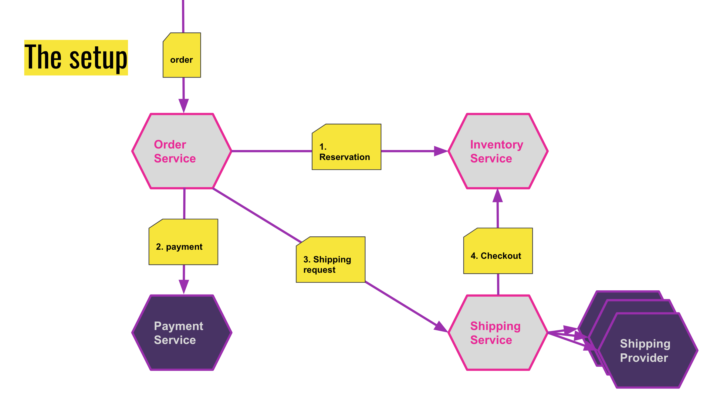

# Tutorial

The following tutorial contains 4 microservices implemented with the help of
[appkernel](https://github.com/accelero-cloud/appkernel), which together serve as a product order-processing, 
payment and shipping solution.
  



The [Order Service](checkout/orders/order_service.py) is responsible for receiving the original request and orchestrate 
the process with all the other services:
1. reserve the products in the [Inventory Service](checkout/inventory/inventory_service.py);
2. carry out the payment, using the [Payment Service](checkout/payments/payment_service.py);
3. request the shipping of the goods at the [Shipping Service](checkout/shipping/shipping_service.py);
4. the [Shipping Service](checkout/shipping/shipping_service.py) will finalise the reservation at the [Inventory Service](checkout/inventory/inventory_service.py);

# Run it in your development environment

## Install requirements

### Docker image for Mongo DB
```bash
docker create -v ~/data:/data/db -p 27017:27017 --name mongo mongo
docker start mongo
```

### Virtual environment and required packages
```bash
git clone git@github.com:accelero-cloud/tutorials.git
cd tutorials
virtualenv -p python3 venv
source venv/bin/activate
pip install -U appkernel
pip install money
```

## Start the services
```bash
python3 order_service_tutorial.py
```

And call the Order Service endpoint with CURL:
```bash
curl -i -X POST -H "Content-Type:application/json" \
   -d '{
    "_type": "tutorials.order_service.Order",
    "delivery_address": {
        "_type": "tutorials.models.Address",
        "city": "Big City",
        "country": "Country",
        "first_name": "John",
        "last_name": "Doe",
        "postal_code": "1234",
        "street": "some address 8"
    },
    "id": "Oc2e5b438-8d12-4533-b085-c38add1e126d",
    "order_date": "2018-09-04T18:51:18.547186",
    "payment_method": {
        "_type": "tutorials.models.Payment",
        "customer_id": "1234567890123456789012",
        "customer_secret": "120",
        "method": "PAYPAL"
    },
    "products": [
        {
            "_type": "tests.test_util.Product",
            "code": "BTX",
            "name": "t-shirt",
            "price": {
                "_type": "money.money.Money",
                "amount": 10,
                "currency": "EUR"
            },
            "size": "M"
        },
        {
            "_type": "tests.test_util.Product",
            "code": "BTX",
            "name": "t-shirt",
            "price": {
                "_type": "money.money.Money",
                "amount": 12,
                "currency": "EUR"
            },
            "size": "L"
        }
    ]
}
' 'http://127.0.0.1:5000/orders/'
```
**You should see the following result**
```bash
HTTP/1.1 100 Continue

HTTP/1.0 201 CREATED
Content-Type: application/json
Content-Length: 87
Server: Werkzeug/0.14.1 Python/3.7.0
Date: Tue, 11 Sep 2018 14:17:43 GMT

{
  "_type": "OperationResult",
  "result": "Oc2e5b438-8d12-4533-b085-c38add1e126d"
}
```

# Run it as a set of docker services


## Notes:
with minimal code we get logging, configuration, command line management, etc.
